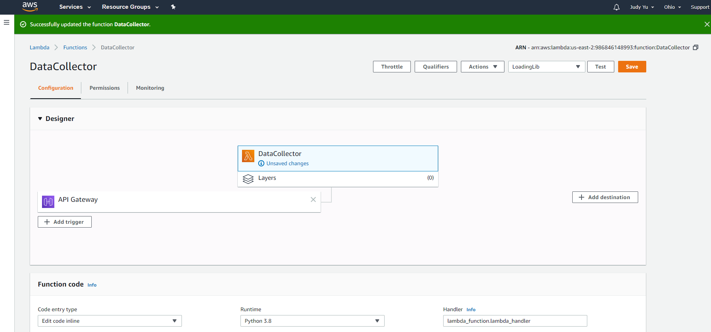
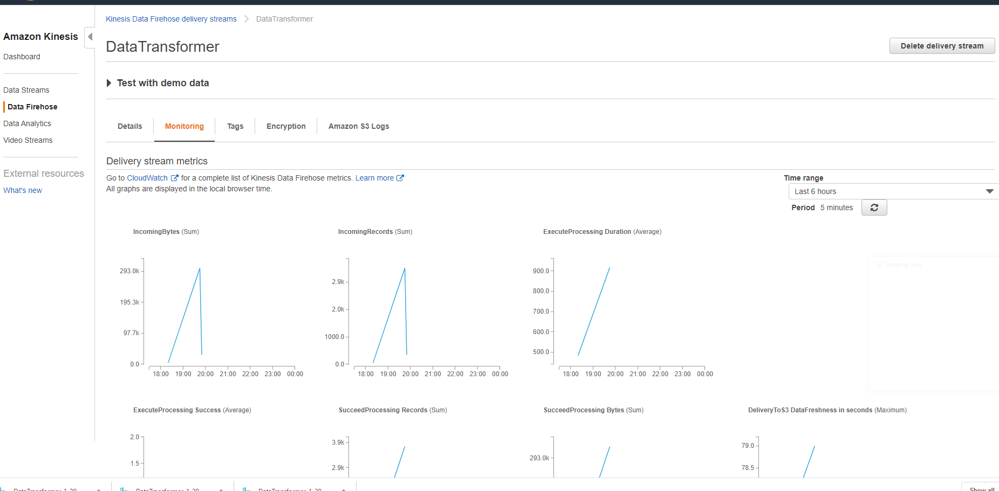

# Project3
Use of AWS Lambda (DataCollector) to read finance data (stock price from Yahoo) and stream the data via AWS Kinesis delivery system, stored in S3. Finally, analyze and query result using AWS Anthena. 

## Data Collector URL:
https://acxdv7kwjg.execute-api.us-east-2.amazonaws.com/default/DataCollector

## Screenshot of DataCollector Lambda

## Screenshot of Kinesis

## Add Visualizations
Plot line charts to display the stock price of listed companies during the day. The fun fact is that 11 am is likely a turning point during the day. 
